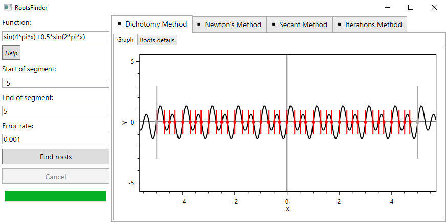

# Roots-Finder
This WPF app allows to find and approximate the root values of non-linear math function and to visualize them along with the graph of the function itself.

This app is the result of course work on the subject of computational mathematics.
## Available methods:
* Dichotomy (bisection, interval halving) method
* Newton's method
* Secant methiod
* Iterations (fixed-point iteration) method
## Screenshot:

## Dependencies:
* [OxyPlot](https://github.com/oxyplot/oxyplot)
* [MathParser.org-mXparser](https://github.com/mariuszgromada/MathParser.org-mXparser)
